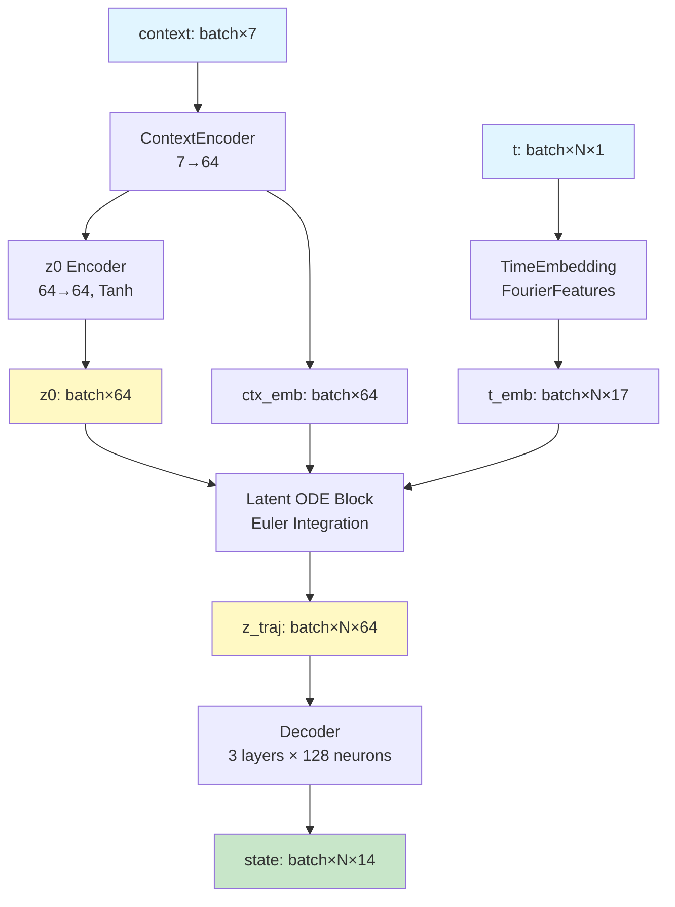
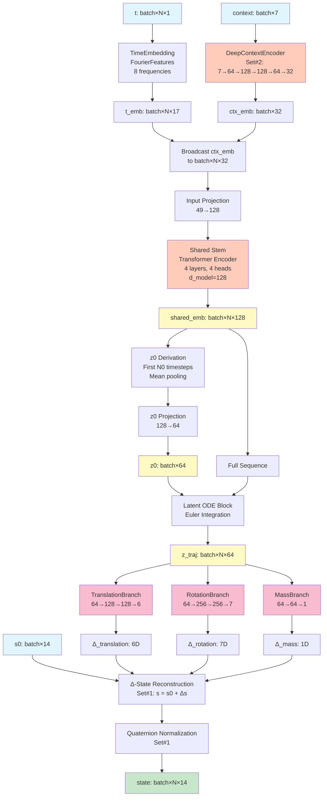
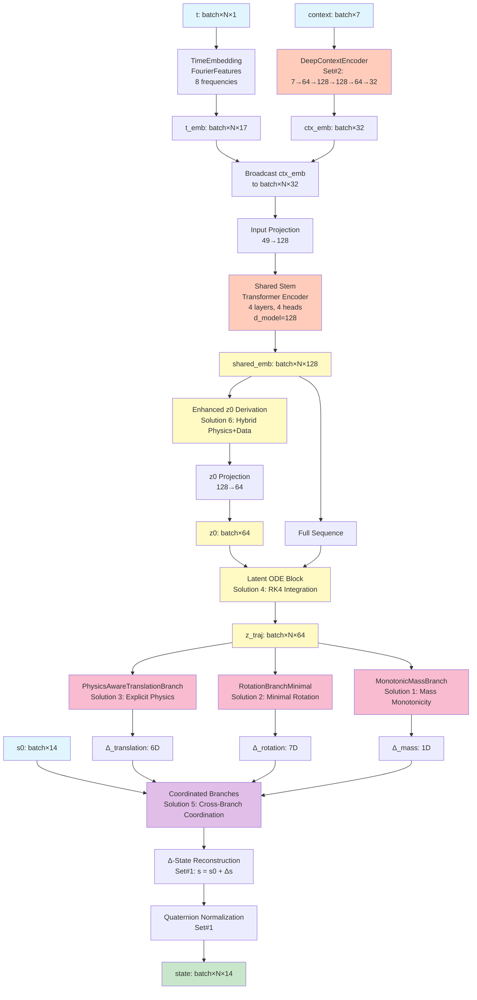
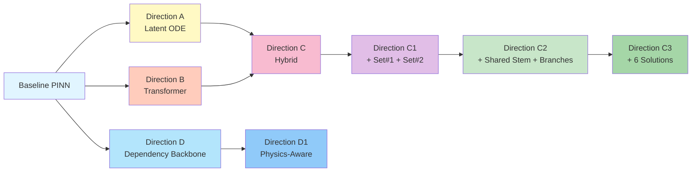

# PINN Architecture Diagrams

This document contains Mermaid diagrams for all PINN architecture variants, from the baseline model through Directions A, B, C, C1, C2, C3, and the dependency-aware Directions D/D1.

## Baseline PINN

The original vanilla MLP architecture that serves as the reference baseline.

```mermaid
graph TD
    A[t: batch×N×1] --> B[TimeEmbedding<br/>FourierFeatures<br/>8 frequencies]
    C[context: batch×7] --> D[ContextEncoder<br/>7→16, Tanh]
    B --> E[t_emb: batch×N×17]
    D --> F[ctx_emb: batch×16]
    E --> G[Broadcast ctx_emb<br/>to batch×N×16]
    F --> G
    G --> H[Concatenate<br/>t_emb || ctx_emb]
    H --> I[MLP<br/>6 layers × 128 neurons<br/>tanh, LayerNorm, Dropout]
    I --> J[state: batch×N×14]
    
    style A fill:#e1f5ff
    style C fill:#e1f5ff
    style J fill:#c8e6c9
```

## Direction A: Latent Neural ODE PINN

Encodes context into initial latent state, evolves through neural ODE, then decodes to physical state.



## Direction B: Sequence Transformer PINN

Treats the full time grid as a sequence and models temporal dependencies via Transformer encoder.

```mermaid
graph TD
    A[t: batch×N×1] --> B[TimeEmbedding<br/>FourierFeatures<br/>8 frequencies]
    C[context: batch×7] --> D[ContextEncoder<br/>7→64, Tanh]
    B --> E[t_emb: batch×N×17]
    D --> F[ctx_emb: batch×64]
    E --> G[Broadcast ctx_emb<br/>to batch×N×64]
    F --> G
    G --> H[Concatenate<br/>t_emb || ctx_emb]
    H --> I[Input Projection<br/>81→128]
    I --> J[Transformer Encoder<br/>4 layers, 4 heads<br/>d_model=128, GELU]
    J --> K[Output Head<br/>MLP: 128→128→14]
    K --> L[state: batch×N×14]
    
    style A fill:#e1f5ff
    style C fill:#e1f5ff
    style J fill:#ffccbc
    style L fill:#c8e6c9
```

## Direction C: Hybrid Sequence + Latent ODE PINN

Combines Transformer encoder for z0 estimation with Latent ODE dynamics.

```mermaid
graph TD
    A[t: batch×N×1] --> B[TimeEmbedding<br/>FourierFeatures]
    C[context: batch×7] --> D[ContextEncoder<br/>7→64]
    B --> E[t_emb: batch×N×17]
    D --> F[ctx_emb: batch×64]
    E --> G[Broadcast ctx_emb<br/>to batch×N×64]
    F --> G
    G --> H[Concatenate<br/>t_emb || ctx_emb]
    H --> I[Transformer Encoder<br/>First N0 timesteps<br/>for z0 estimation]
    I --> J[z0 Pooling<br/>Mean over N0]
    J --> K[z0 Projection<br/>128→64]
    K --> L[z0: batch×64]
    
    E --> M[Full Time Grid]
    F --> M
    L --> N[Latent ODE Block<br/>Euler Integration]
    M --> N
    N --> O[z_traj: batch×N×64]
    
    O --> P[Decoder<br/>3 layers × 128 neurons]
    P --> Q[state: batch×N×14]
    
    style A fill:#e1f5ff
    style C fill:#e1f5ff
    style I fill:#ffccbc
    style L fill:#fff9c4
    style O fill:#fff9c4
    style Q fill:#c8e6c9
```

## Direction C1: Enhanced Hybrid PINN

Adds Set#1 (Output Stability) and Set#2 (Deep Context Encoder) improvements.

```mermaid
graph TD
    A[t: batch×N×1] --> B[TimeEmbedding<br/>FourierFeatures]
    C[context: batch×7] --> D[DeepContextEncoder<br/>Set#2: 7→64→128→128→64→32<br/>GELU, LayerNorm]
    B --> E[t_emb: batch×N×17]
    D --> F[ctx_emb: batch×32]
    E --> G[Broadcast ctx_emb<br/>to batch×N×32]
    F --> G
    G --> H[Concatenate<br/>t_emb || ctx_emb]
    H --> I[Transformer Encoder<br/>First N0 timesteps<br/>for z0 estimation]
    I --> J[z0 Pooling<br/>Mean over N0]
    J --> K[z0 Projection<br/>128→64]
    K --> L[z0: batch×64]
    
    E --> M[Full Time Grid]
    F --> M
    L --> N[Latent ODE Block<br/>Euler Integration]
    M --> N
    N --> O[z_traj: batch×N×64]
    
    O --> P[Output Heads<br/>Set#1: Split Heads]
    P --> Q1[Translation Head<br/>64→128→128→6]
    P --> Q2[Rotation Head<br/>64→128→128→7]
    P --> Q3[Mass Head<br/>64→64→1]
    
    Q1 --> R1[Δ_translation: 6D]
    Q2 --> R2[Δ_rotation: 7D]
    Q3 --> R3[Δ_mass: 1D]
    
    S[s0: batch×14] --> T[Δ-State Reconstruction<br/>Set#1: s = s0 + Δs]
    R1 --> T
    R2 --> T
    R3 --> T
    T --> U[Quaternion Normalization<br/>Set#1]
    U --> V[state: batch×N×14]
    
    style A fill:#e1f5ff
    style C fill:#e1f5ff
    style S fill:#e1f5ff
    style D fill:#ffccbc
    style I fill:#ffccbc
    style L fill:#fff9c4
    style O fill:#fff9c4
    style P fill:#f8bbd0
    style V fill:#c8e6c9
```

## Direction C2: Shared Stem + Dedicated Branches

Introduces Shared Stem for unified temporal+context processing and Dedicated Branches for specialized outputs.



## Direction C3: Enhanced C2 with RMSE Reduction Solutions

C2 architecture enhanced with 6 architectural solutions for RMSE reduction.



## Direction D: Dependency-Aware Backbone

Single shared MLP backbone with ordered heads (mass → attitude → translation) to preserve physics dependencies without latent ODE blocks.

```mermaid
graph TD
    A[t: batch×N×1] --> B[FourierFeatures<br/>8 freq → 17D]
    C[context: batch×7] --> D[ContextEncoder<br/>7→32, GELU]
    B --> E[t_emb: batch×N×17]
    D --> F[ctx_emb: batch×N×32]
    E --> G[Concatenate<br/>t_emb || ctx_emb]
    F --> G
    G --> H[Shared Backbone<br/>MLP 4×256]
    H --> I[G3 Mass Head<br/>[128,64]→1]
    I --> J[m_pred]
    
    %% Attitude Head
    H --> K1[latent copy]
    J --> K2[m copy]
    K1 --> L1
    K2 --> L1
    L1[Concat latent || m] --> M[G2 Attitude Head<br/>[256,128,64]→7]
    M --> N[normalize_quaternion]
    
    %% Translation Head
    H --> P1[latent copy₂]
    J --> P2[m copy₂]
    N --> P3[q_norm, w]
    P1 --> Q[Concat latent || m || q || w]
    P2 --> Q
    P3 --> Q
    Q --> R[G1 Translation Head<br/>[256,128,128,64]→6]
    
    %% Assemble state
    R --> S[translation]
    N --> T[rotation + ω]
    J --> U[mass]
    S --> V[state: batch×N×14]
    T --> V
    U --> V

    style A fill:#e1f5ff
    style C fill:#e1f5ff
    style H fill:#fff9c4
    style I fill:#ffecb3
    style P fill:#ffe0b2
    style X fill:#ffccbc
    style Z fill:#c8e6c9
```

## Direction D1: Physics-Aware Dependency Backbone

Extends Direction D with physics feature injection, 6D rotation representation, and causal RK4 integration to reconstruct translation from predicted accelerations.

```mermaid
graph TD
    A[t: batch×N×1] --> B[FourierFeatures<br/>8 freq]
    C[context: batch×7] --> D[ContextEncoder<br/>7→32]
    B --> E[t_emb]
    D --> F[ctx_emb]
    E --> G[Concat]
    F --> G
    G --> H[Shared Backbone<br/>4×256]
    
    %% Mass head
    H --> I[G3 Mass Head] --> J[m_pred]
    
    %% Physics features
    G --> K[Context broadcast]
    A --> L[t grid]
    L --> M[Altitude / velocity estimate]
    M --> N[Physics Layer<br/>density, q_dyn, aero]
    K --> N
    N --> O[physics_feat]
    
    %% Attitude head with 6D rotation
    H --> P[latent copy]
    J --> Q
    O --> R
    P --> S[Concat latent || m || physics]
    Q --> S
    R --> S
    S --> T[G2 Head<br/>6D rot + ω]
    T --> U[6D → quaternion]
    
    %% Acceleration head + integrator
    H --> V[latent copy₂]
    J --> W
    U --> X[rotation]
    T --> Y[angular velocity]
    O --> Z
    V --> AA[Concat latent || m || R || ω || physics]
    W --> AA
    X --> AA
    Y --> AA
    Z --> AA
    AA --> AB[G1 Accel Head]
    AB --> AC[Temporal Integrator<br/>RK4]
    AC --> AD[translation (z,v)]
    
    %% Assemble final state
    AD --> AE
    U --> AE
    Y --> AE
    J --> AE
    AE[state: batch×N×14]

    style A fill:#e1f5ff
    style C fill:#e1f5ff
    style H fill:#fff9c4
    style I fill:#ffecb3
    style T fill:#ffe0b2
    style AB fill:#ffccbc
    style AC fill:#d1c4e9
    style AE fill:#c8e6c9
```

## Architecture Comparison Summary

| Architecture | Key Features | RMSE (Typical) |
|--------------|--------------|----------------|
| **Baseline** | Vanilla MLP, Fourier features, shallow context encoder | ~0.9 |
| **Direction A** | Latent ODE, encode-evolve-decode | ~0.85-0.9 |
| **Direction B** | Transformer sequence model | ~0.86 |
| **Direction C** | Hybrid: Transformer z0 + Latent ODE | ~0.9 |
| **Direction C1** | C + Set#1 (stability) + Set#2 (deep context) | ~0.84 |
| **Direction C2** | C1 + Shared Stem + Dedicated Branches | ~0.96 |
| **Direction C3** | C2 + 6 RMSE reduction solutions | Target: 0.60-0.75 |
| **Direction D** | Dependency-aware backbone with ordered heads | ~0.30 |
| **Direction D1** | Direction D + physics features + RK4 integration | ~0.28-0.29 |

## Component Relationships



## Data Flow Summary

All architectures follow the same input/output interface:

```
Input:  (t: [batch, N, 1], context: [batch, 7])
Output: state: [batch, N, 14]
```

Where:
- `t`: Nondimensional time grid
- `context`: Normalized context parameters (m0, Isp, Cd, CL_alpha, Cm_alpha, Tmax, wind_mag)
- `state`: 14D state vector [x, y, z, vx, vy, vz, q0, q1, q2, q3, wx, wy, wz, m]

## References

- **Architecture Changelog**: [ARCHITECTURE_CHANGELOG.md](ARCHITECTURE_CHANGELOG.md) - Detailed implementation history
- **Thesis Notes**: [thesis_notes.md](thesis_notes.md) - Research notes and development decisions
- **C3 Implementation Guide**: [expANAL_SOLS.md](expANAL_SOLS.md) - C3 architecture details and solutions
