# PINN Architecture Diagrams

This document contains Mermaid diagrams for all PINN architecture variants, from the baseline model through Directions A, B, C, C1, C2, C3, and the dependency-aware Directions D/D1.

## Baseline PINN

The original vanilla MLP architecture that serves as the reference baseline.

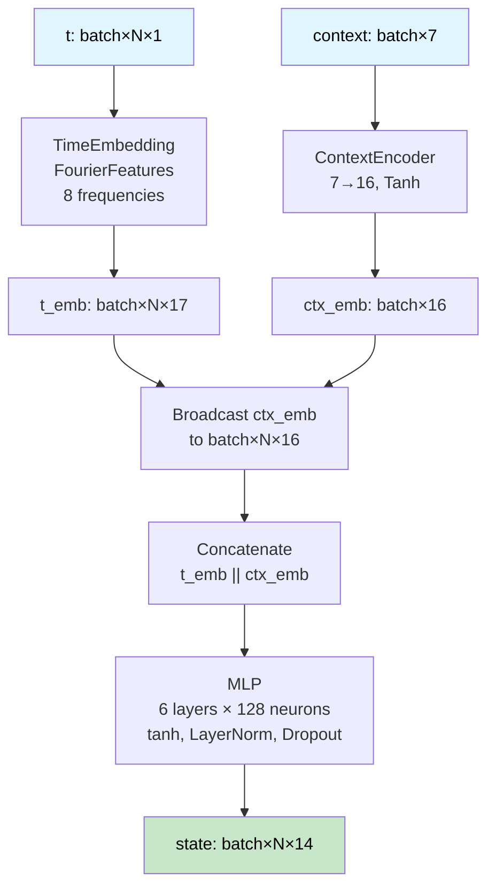

## Direction A: Latent Neural ODE PINN

Encodes context into initial latent state, evolves through neural ODE, then decodes to physical state.

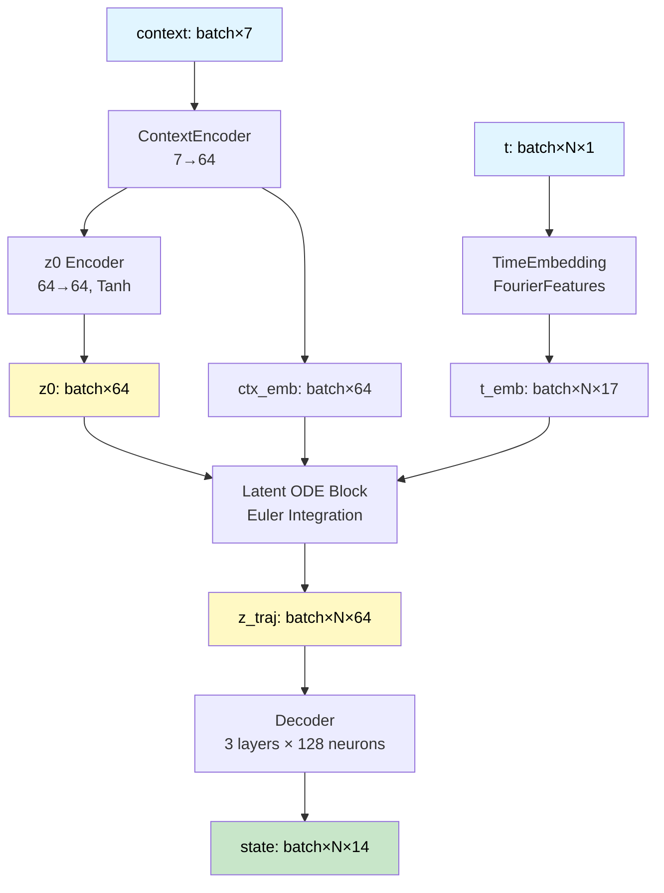

## Direction B: Sequence Transformer PINN

Treats the full time grid as a sequence and models temporal dependencies via Transformer encoder.

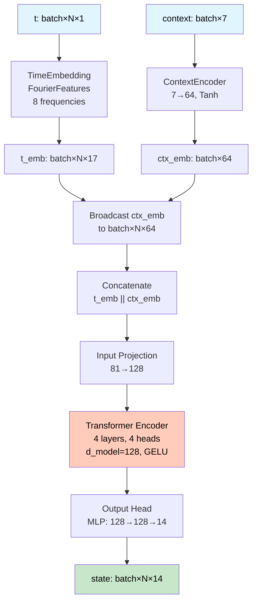

## Direction C: Hybrid Sequence + Latent ODE PINN

Combines Transformer encoder for z0 estimation with Latent ODE dynamics.

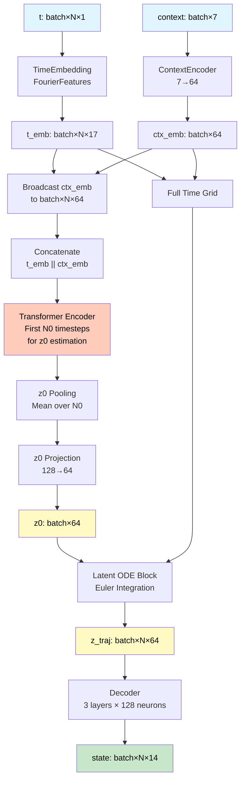

## Direction C1: Enhanced Hybrid PINN

Adds Set#1 (Output Stability) and Set#2 (Deep Context Encoder) improvements.

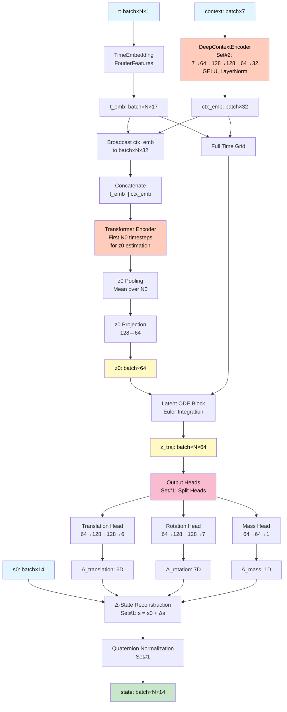

## Direction C2: Shared Stem + Dedicated Branches

Introduces Shared Stem for unified temporal+context processing and Dedicated Branches for specialized outputs.

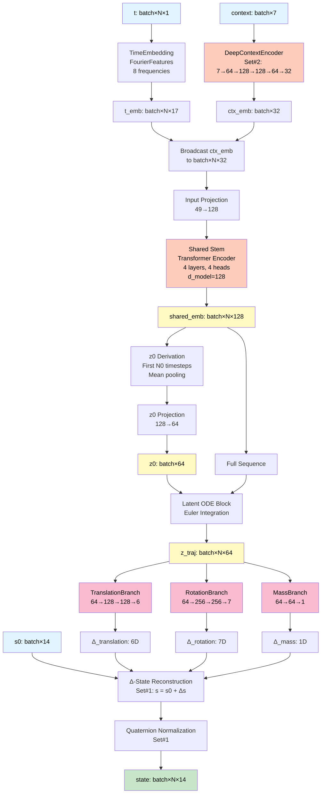

## Direction C3: Enhanced C2 with RMSE Reduction Solutions

C2 architecture enhanced with 6 architectural solutions for RMSE reduction.


## Direction D: Dependency-Aware Backbone

Single shared MLP backbone with ordered heads (mass → attitude → translation) to preserve physics dependencies without latent ODE blocks.

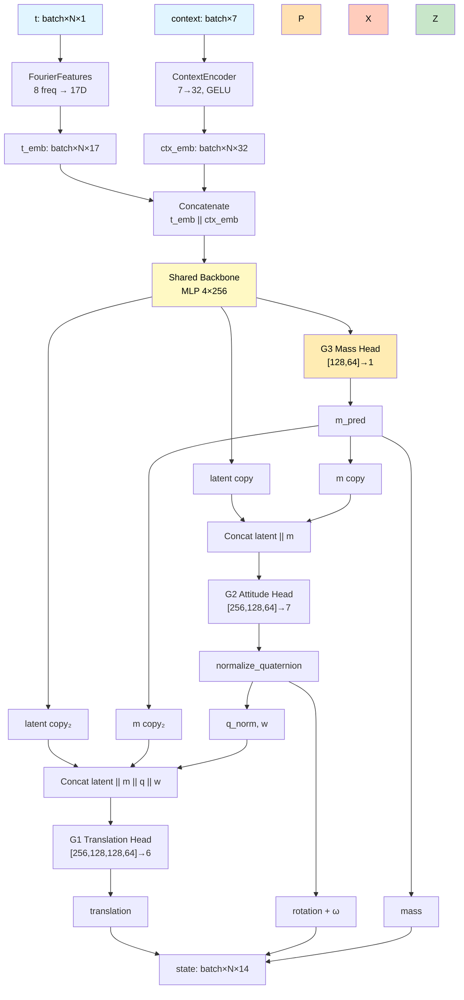

## Direction D1: Physics-Aware Dependency Backbone

Extends Direction D with physics feature injection, 6D rotation representation, and causal RK4 integration to reconstruct translation from predicted accelerations.

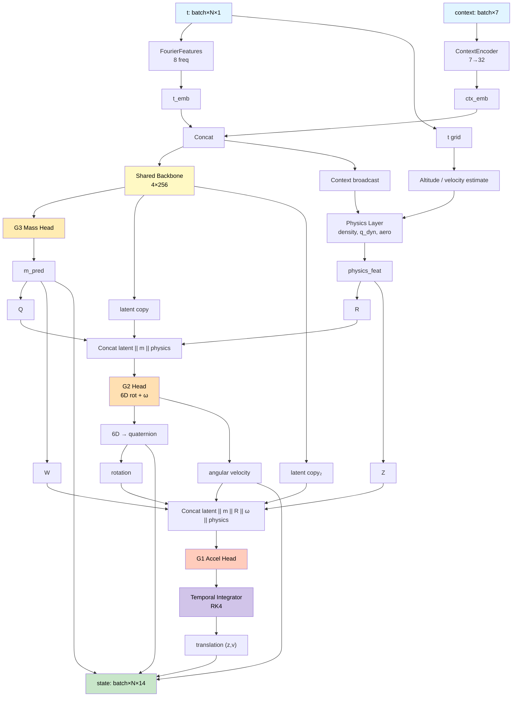

## Direction D1.5: Soft-Physics Dependency Backbone

Adds light physics hints and optional structural constraints while keeping Direction D’s direct state predictions (no explicit integrator).

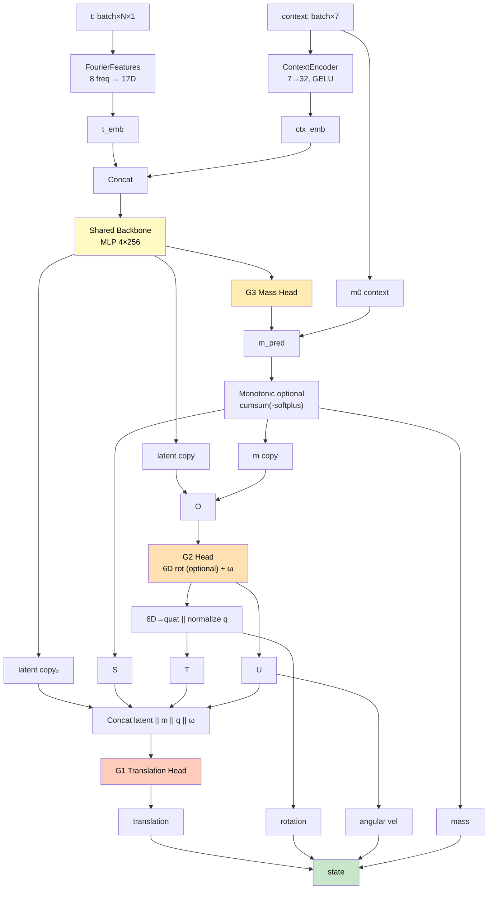

## Direction D1.5.3: V2 Dataloader and Loss Function

Same architecture as Direction D1.5, but uses v2 dataloader (T_mag, q_dyn) and adjusted loss weights. Models receive v2 features but currently ignore them (future: v2 model versions will use InputBlockV2).

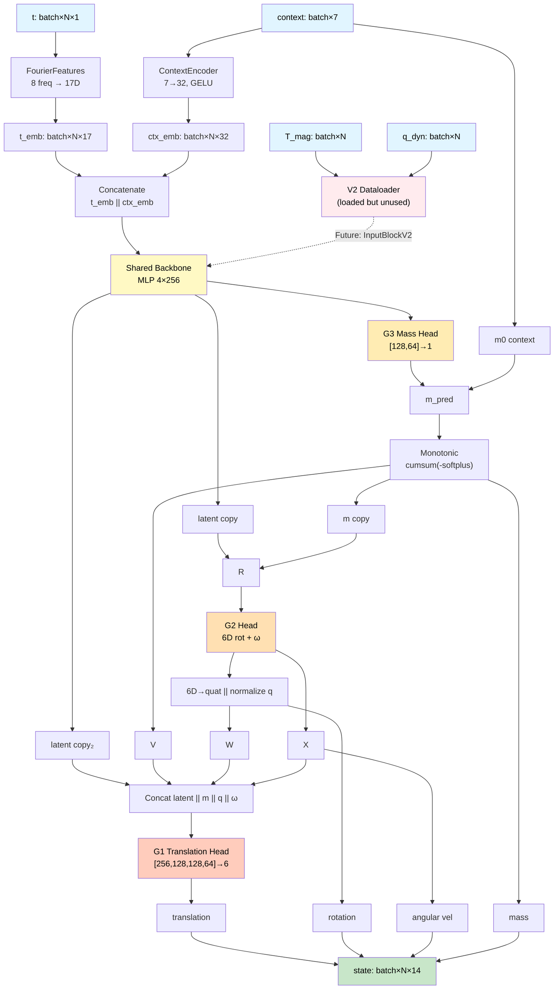

## Direction AN (Baseline): Shared Stem + Mission Branches + Physics Residuals

Shared stem with residual MLP, independent mission branches predicting full translation state, and physics residual layer that computes full ODE residuals.

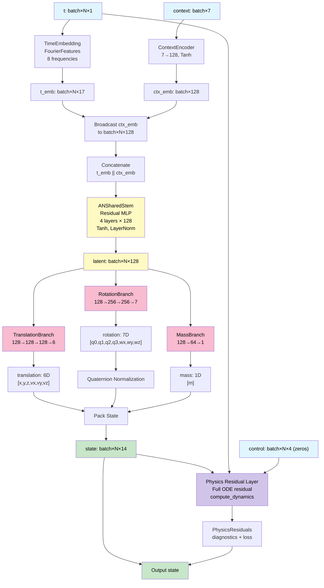

## Direction AN1: Shared Stem + Physics-Guided Surrogate

Refinement of AN with reduced translation head, x/y integration, monotonic mass branch, and physics residuals used in a vertical-only loss.

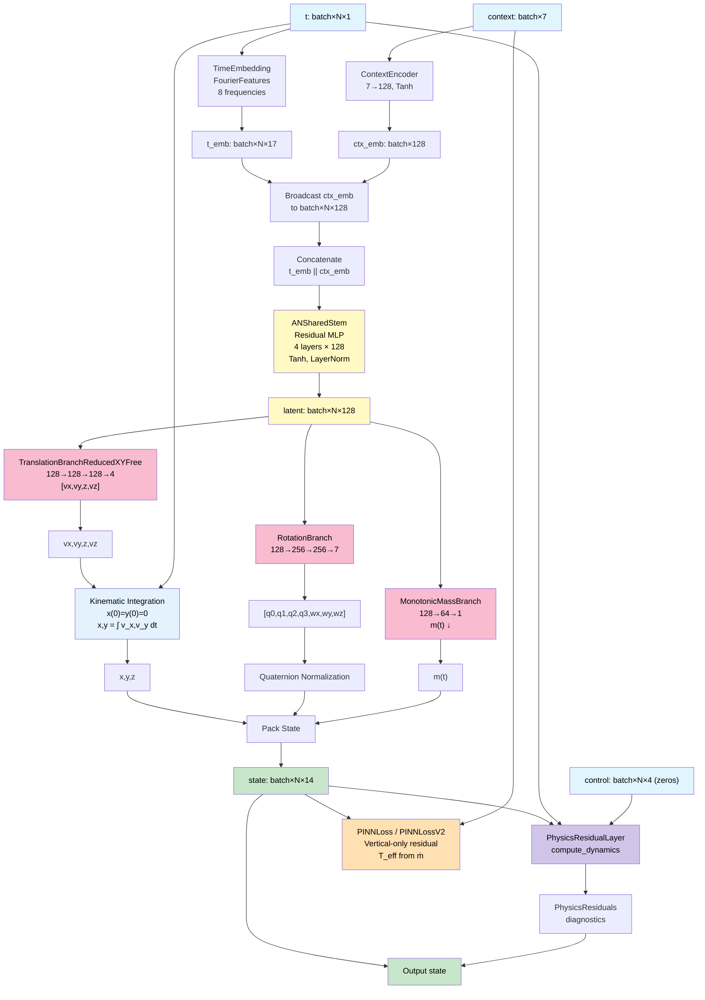

## Architecture Comparison Summary

| Architecture | Key Features | RMSE (Typical) |
|--------------|--------------|----------------|
| **Baseline** | Vanilla MLP, Fourier features, shallow context encoder | ~0.9 |
| **Direction A** | Latent ODE, encode-evolve-decode | ~0.85-0.9 |
| **Direction B** | Transformer sequence model | ~0.86 |
| **Direction C** | Hybrid: Transformer z0 + Latent ODE | ~0.9 |
| **Direction C1** | C + Set#1 (stability) + Set#2 (deep context) | ~0.84 |
| **Direction C2** | C1 + Shared Stem + Dedicated Branches | ~0.96 |
| **Direction C3** | C2 + 6 RMSE reduction solutions | Target: 0.60-0.75 |
| **Direction D** | Dependency-aware backbone with ordered heads | ~0.30 |
| **Direction D1** | Direction D + physics features + RK4 integration | ~0.28-0.29 |
| **Direction D1.5** | D + soft physics + mass monotonicity + 6D rotation | ~0.20 |
| **Direction D1.5.3** | D1.5 + v2 dataloader (T_mag, q_dyn) + v2 loss | **0.198** |
| **Direction D1.5.4** | D1.5 + central diff (PINNLossV2) | **0.254** |
| **Direction AN** | Shared stem + mission branches + full ODE residual | **0.197** |
| **Direction AN1** | AN + x/y integration, monotonic mass, vertical-only residual | **0.197** |

## Component Relationships

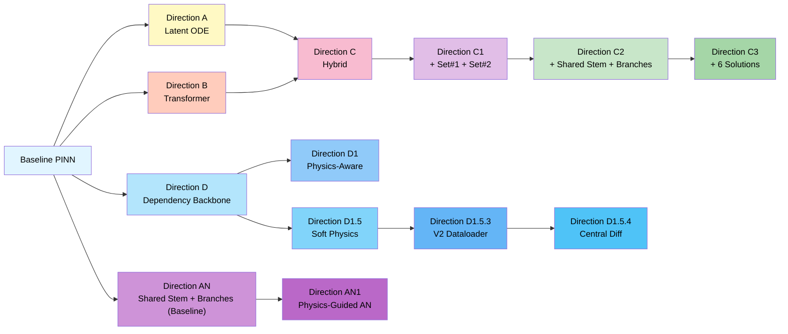

## Data Flow Summary

All architectures follow the same input/output interface:

```
Input:  (t: [batch, N, 1], context: [batch, 7])
Output: state: [batch, N, 14]
```

Where:
- `t`: Nondimensional time grid
- `context`: Normalized context parameters (m0, Isp, Cd, CL_alpha, Cm_alpha, Tmax, wind_mag)
- `state`: 14D state vector [x, y, z, vx, vy, vz, q0, q1, q2, q3, wx, wy, wz, m]

## References

- **Architecture Changelog**: [ARCHITECTURE_CHANGELOG.md](ARCHITECTURE_CHANGELOG.md) - Detailed implementation history
- **Thesis Notes**: [thesis_notes.md](thesis_notes.md) - Research notes and development decisions
- **C3 Implementation Guide**: [expANAL_SOLS.md](expANAL_SOLS.md) - C3 architecture details and solutions
